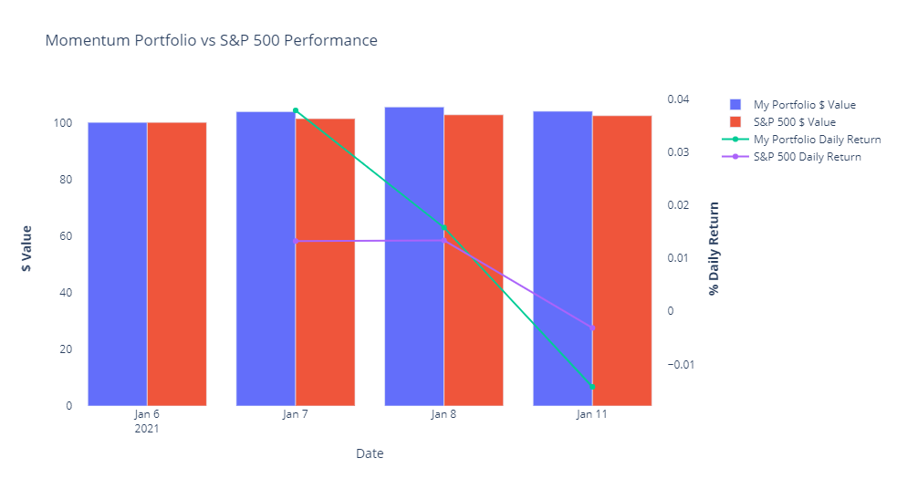

# momentum-value-portfolio
Momentum vs Value Portfolio of 50-best S&amp;P500 stocks
# Summary
I am using "yahoofinancials" and "yfinance" libraries to access prices and value indicators of stocks in SP500 index, constructing portfolio of 50 best momentum/value stocks and back test reallocation approaches
## Dependencies
```python
import pandas_datareader.data as web
import pandas as pd
from datetime import date
import yahoo_fin.stock_info as si
from yahoo_fin.stock_info import get_data
import numpy as np
import math
import time
from yahoofinancials import YahooFinancials
from scipy import stats
from statistics import mean
from scipy.stats import percentileofscore
from datetime import datetime, timedelta
import pandas_market_calendars as mcal
from decimal import Decimal
import matplotlib.pyplot as plt
import seaborn as sns
sns.set_style('whitegrid')
%matplotlib inline
import plotly.graph_objects as go
from plotly.offline import iplot
import plotly.express as px
from plotly.subplots import make_subplots
import pickle
import yfinance as yf
```
## List of stocks in SP500
Uploading stocks in SP500 using ```yahoo_fin.stock_info```
```python
sp_list = si.tickers_sp500()
len(sp_list)
```
## Loading prices for 1 year
SP500 combined price for 1 year
```python
sp = yf.Ticker('^GSPC').history(period='1y')
sp
```
Prices for individual stocks in SP500:
```python
my_col = ['Date', 'Open', 'High', 'Low', 'Close', 'Volume', 'Dividends', 'Stock Splits', 'Ticker']
placeholder = pd.DataFrame(columns=my_col)
for ii in sp_list:
    tick = yf.Ticker(ii)
    df = tick.history(period='1y')
    df.reset_index(inplace=True)
    df['Ticker'] = ii
    placeholder = placeholder.append(df, ignore_index=True)
```
Leaving only needed info:
```python
all_prices.drop(columns=['Close', 'High', 'Low', 'Volume', 'Dividends', 'Stock Splits'#, 'Adj Close'
                        ], 
                inplace=True)
all_prices['Date'] = pd.to_datetime(all_prices['Date'])
all_prices.head()
```
## Calculating price returns
In order to calculate price returns I need to get prices for specic periods with accordance to NYSE calendar:
```python
nyse = mcal.get_calendar('NYSE')

today = datetime.today().strftime('%Y-%m-%d')

month_from_today = (datetime.today() - timedelta(days=30)).strftime('%Y-%m-%d')
three_month_from_today = (datetime.today() - timedelta(days=90)).strftime('%Y-%m-%d')
six_month_from_today = (datetime.today() - timedelta(days=180)).strftime('%Y-%m-%d')
year_from_today = (datetime.today() - timedelta(days=365)).strftime('%Y-%m-%d')

nyse_month_from_today = nyse.valid_days(start_date=f'{month_from_today}', end_date=f'{today}')[0].strftime('%Y-%m-%d')
nyse_three_month_from_today = nyse.valid_days(start_date=f'{three_month_from_today}', end_date=f'{today}')[0].strftime('%Y-%m-%d')
nyse_six_month_from_today = nyse.valid_days(start_date=f'{six_month_from_today}', end_date=f'{today}')[0].strftime('%Y-%m-%d')
nyse_year_from_today = nyse.valid_days(start_date=f'{year_from_today}', end_date=f'{today}')[0].strftime('%Y-%m-%d')
print(nyse_month_from_today)
print(nyse_three_month_from_today)
print(nyse_six_month_from_today)
print(nyse_year_from_today)
```
Selecting only needed prices ranges from dataframe with historic 1 year prices
```python
all_prices_five = all_prices[
                            (all_prices['Date'] == f'{today}') | 
                            (all_prices['Date'] == f'{nyse_month_from_today}') |
                            (all_prices['Date'] == f'{nyse_three_month_from_today}') |
                            (all_prices['Date'] == f'{nyse_six_month_from_today}') |
                            (all_prices['Date'] == f'{nyse_year_from_today}')]
all_prices_five['1 Month Return'] = np.nan
all_prices_five['3 Month Return'] = np.nan
all_prices_five['6 Month Return'] = np.nan
all_prices_five['1 Year Return'] = np.nan
all_prices_five.head()
```
Calculating price returns:
```python
for i in sp_list:
    try:
        current_price = all_prices_five[(all_prices_five['Ticker'] == f'{i}') & (all_prices_five['Date'] == f'{today}')]['Open'].item()
        one_month_price = all_prices_five[(all_prices_five['Ticker'] == f'{i}') & (all_prices_five['Date'] == f'{nyse_month_from_today}')]['Open'].item()
        one_month_return = (current_price/one_month_price)-1
    except ValueError:
        one_month_return = np.nan
    try:
        three_month_price = all_prices_five[(all_prices_five['Ticker'] == f'{i}') & (all_prices_five['Date'] == f'{nyse_three_month_from_today}')]['Open'].item()
        three_month_return = (current_price/three_month_price)-1
    except ValueError:
        three_month_return = np.nan
    
    try:
        six_month_price = all_prices_five[(all_prices_five['Ticker'] == f'{i}') & (all_prices_five['Date'] == f'{nyse_six_month_from_today}')]['Open'].item()
        six_month_return = (current_price/six_month_price)-1
    except ValueError:
        six_month_return = np.nan
    try:
        one_year_price = all_prices_five[(all_prices_five['Ticker'] == f'{i}') & (all_prices_five['Date'] == f'{nyse_year_from_today}')]['Open'].item()
        one_year_return = (current_price/one_year_price)-1
    except ValueError:
        one_year_return = np.nan

    all_prices_five.loc[all_prices_five[all_prices_five['Ticker'] == f'{i}'].index, '1 Month Return'] = one_month_return
    all_prices_five.loc[all_prices_five[all_prices_five['Ticker'] == f'{i}'].index, '3 Month Return'] = three_month_return
    all_prices_five.loc[all_prices_five[all_prices_five['Ticker'] == f'{i}'].index, '6 Month Return'] = six_month_return
    all_prices_five.loc[all_prices_five[all_prices_five['Ticker'] == f'{i}'].index, '1 Year Return'] = one_year_return

all_prices_five.head()
```
## Momentum Percentiles
Calculating momentum percentiles with High Quality Momentum Score (mean of momentum score for 1 Month, 3 Months, 6 Months and 1 Year)
```python
for row in all_returns.index:
    for time_period in time_periods:
        all_returns.loc[row, f'{time_period} Return Percentile'] = stats.percentileofscore(all_returns[f'{time_period} Return'], all_returns.loc[row, f'{time_period} Return'])/100

all_returns['HQM Score'] = 'N/A'
all_returns.head()
```
## Selecting 50 Best Momentum Stocks
```python
all_returns_fifty = all_returns.sort_values('HQM Score', ascending=False)
all_returns_fifty = all_returns_fifty[:50]
all_returns_fifty.reset_index(inplace=True, drop=True)
all_returns_fifty['Number of Shares to Buy'] = 'N/A'
```
## Portfolio size and value
Function for calculating portfolio and position sizes:
```python
def portfolio_input():
    global portfolio_size
    portfolio_size = input('Enter the size of your portfolio: ')
    try:
        float(portfolio_size)
    except ValueError:
        print('Not a number \nPlease try again')
        portfolio_size = input('Enter the size of your portfolio: ')
all_returns_fifty.head()
```
Portfolio value:
```python
invested_one_six['$ Amount of Shares'] = (invested_one_six['Number of Shares to Buy']).apply(Decimal) * (invested_one_six['Open']).apply(Decimal)
portfolio_value_one_six = invested_one_six['$ Amount of Shares'].sum()
portfolio_value_one_six = float(portfolio_value_one_six)
portfolio_value_one_six
```
## Pure SP500 portfolio to use as a benchmark
```python
today = datetime.today().strftime('%Y-%m-%d')
sp = yf.Ticker('^GSPC').history(period='1y')
sp.drop(columns=['Close', 'High', 'Low', 'Volume', 'Dividends', 'Stock Splits'], inplace=True)
sp.reset_index(inplace=True)
sp = sp[sp['Date'] == today]

sp['$ Amount of Shares'] = (0.026940) * (sp['Open'])

with open ('outfile', 'rb') as fp:
    sp500_value_tracker_list = pickle.load(fp)
fp.close()
sp500_value_tracker_list.append([today, sp['$ Amount of Shares'].item(), 'N/A'])
dump = sp500_value_tracker_list
with open('outfile', 'wb') as fp:
    pickle.dump(dump, fp)
fp.close()


coll = ['Date', '$ Value', 'Daily Return']
sp500_value_tracker = pd.DataFrame(sp500_value_tracker_list, columns=coll)
sp500_value_tracker['Daily Return'] = sp500_value_tracker['$ Value'].pct_change()
sp500_value_tracker

port_value_tracker_list = [['2021-01-06', portfolio_value_one_six, 'N/A']]
```
## Portfolio Value on certain date to track performance
```python
my_col = ['Date', 'Open', 'High', 'Low', 'Close', 'Volume', 'Dividends', 'Stock Splits', 'Ticker']
placeholder = pd.DataFrame(columns=my_col)
for ii in invested_one_six_stocks_list:
    tick = yf.Ticker(ii)
    df = tick.history(period='1y')
    df.reset_index(inplace=True)
    df['Ticker'] = ii
    placeholder = placeholder.append(df, ignore_index=True)


today = datetime.today().strftime('%Y-%m-%d')
my_port = placeholder.drop(columns=['Close', 'High', 'Low', 'Volume', 'Dividends', 'Stock Splits'#, 'Adj Close'
                        ], )
my_port['Date'] = pd.to_datetime(my_port['Date'])
my_port = my_port[my_port['Date'] == today]
my_port = my_port.merge(invested_one_six[['Ticker', 'Number of Shares to Buy']], how='left', on='Ticker')

my_port['$ Amount of Shares'] = (my_port['Number of Shares to Buy']).apply(Decimal) * (my_port['Open']).apply(Decimal)
my_port_value = my_port['$ Amount of Shares'].sum()
my_port_value = float(my_port_value)

with open ('poutfile', 'rb') as fpp:
    port_value_tracker_list = pickle.load(fpp)
fpp.close()

port_value_tracker_list.append([today, my_port_value, 'N/A'])
dumpp = port_value_tracker_list
with open('poutfile', 'wb') as fpp:
    pickle.dump(dumpp, fpp)
fpp.close()
print(my_port_value)

col = ['Date', '$ Value', 'Daily Return']
my_port_value_tracker = pd.DataFrame(port_value_tracker_list, columns=col)
my_port_value_tracker['Daily Return'] = my_port_value_tracker['$ Value'].pct_change()
my_port_value_tracker
```
## Visualizing comparison with benchmark using plotly

```python
# Create figure with secondary y-axis
fig = make_subplots(specs=[[{"secondary_y": True}]])

# Add traces
fig.add_trace(
    go.Bar(x=my_port_value_tracker['Date'], y=my_port_value_tracker['$ Value'], name="My Portfolio $ Value"),
    secondary_y=False,
)

fig.add_trace(
    go.Bar(x=sp500_value_tracker['Date'], y=sp500_value_tracker['$ Value'], name="S&P 500 $ Value", 
           text=sp500_value_tracker['$ Value']),
    secondary_y=False,
)

fig.add_trace(
    go.Scatter(x=my_port_value_tracker['Date'], y=my_port_value_tracker['Daily Return'], name="My Portfolio Daily Return"),
    secondary_y=True,
)

fig.add_trace(
    go.Scatter(x=sp500_value_tracker['Date'], y=sp500_value_tracker['Daily Return'], name="S&P 500 Daily Return"),
    secondary_y=True,
)


# Add figure title
fig.update_layout(
    title_text="Momentum Portfolio vs S&P 500 Performance", plot_bgcolor="white"
)
dt_breaks = ['2021-01-09', '2021-01-10']
# Set x-axis title
fig.update_xaxes(title_text="Date", rangebreaks=[dict(values=dt_breaks)])

# Set y-axes titles
fig.update_yaxes(title_text="<b>$ Value</b>", secondary_y=False)
fig.update_yaxes(title_text="<b>% Daily Return</b>", secondary_y=True)

fig.show()
```
## Backtesting to approach reallocation
According to 2019 prices the best returns achieved with no reallocation during the year:

SP 500 1 Year Return:  0.14830536414326212<br>
My Portfolio (No Reallocation) 1 Year Return:  **0.3907687604295591**

SP 500 1 Year Return:  0.14830536414326212<br>
My Portfolio (Monthly Reallocation) 1 Year Return:  0.2945947087915368

SP 500 1 Year Return:  0.14830536414326212<br>
My Portfolio (Monthly Reallocation) 1 Year Return:  0.20525109224255145

SP 500 1 Year Return:  0.1708361982254436<br>
My Portfolio (Once a Year Reallocation) 1 Year Return:  0.29643392705957616
```python
col = ['Date', '$ Value', 'Daily Return']
my_port_value_tracker_onceayear_reallocation = pd.DataFrame(port_value_tracker_list, columns=col)
my_port_value_tracker_onceayear_reallocation['Daily Return'] = my_port_value_tracker_onceayear_reallocation['$ Value'].pct_change()
my_port_value_tracker_onceayear_reallocation
sum_sp500 = (compare['SP Return']+1).prod()-1
print('SP 500 1 Year Return: ',sum_sp500)
sum_prt = (my_port_value_tracker_onceayear_reallocation['Daily Return']+1).prod()-1
print('My Portfolio (Monthly Reallocation) 1 Year Return: ',sum_prt)
```
